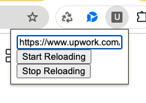

# Auto Page Reloader Chrome Extension

## Description

This Chrome extension automatically reloads specified web pages at regular intervals. It checks all open tabs and reloads any that match the configured URL.

## Features

- Automatically reloads tabs with a specified URL
- Customizable reload interval
- Works across multiple tabs
- Lightweight and easy to use

## Installation

1. Clone this repository or download the ZIP file
2. Open Chrome and navigate to `chrome://extensions/`
3. Enable "Developer mode" in the top right corner
4. Click "Load unpacked" and select the extension directory

## Usage

1. Click on the extension icon in your Chrome toolbar
2. Enter the URL you want to auto-reload
3. Set the desired reload interval (in seconds)
4. Click "Start" to begin auto-reloading

## Configuration

You can modify the following settings:

- Target URL: The web page you want to auto-reload
- Reload Interval: Time between reloads (in seconds)

## Contributing

Contributions are welcome! Please feel free to submit a Pull Request.

## License

[MIT License](LICENSE)

## Support

If you encounter any problems or have any suggestions, please open an issue on this GitHub repository.

## Developer
Created by Dody Rachmat Wicaksono

For more information or to discuss potential projects, please visit my [Upwork profile](https://bit.ly/3Wm34Kd).

## Screenshots

